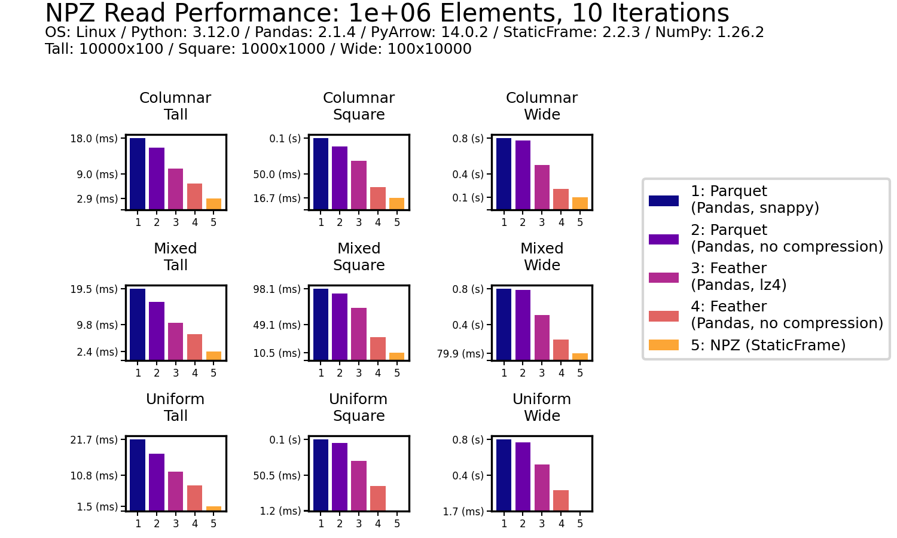
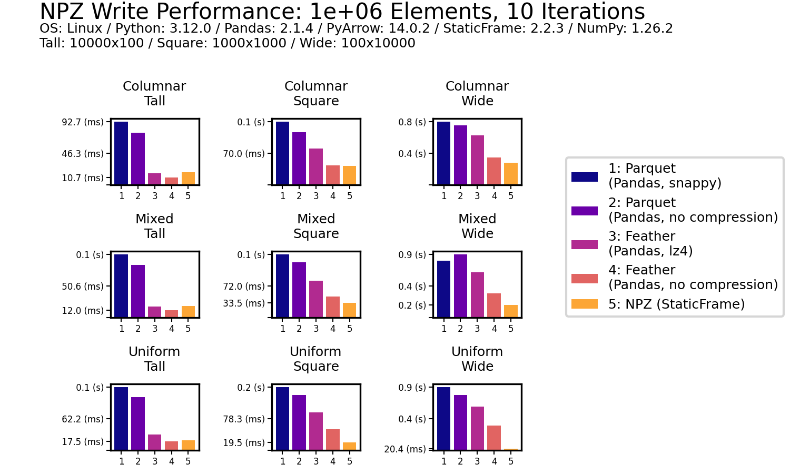
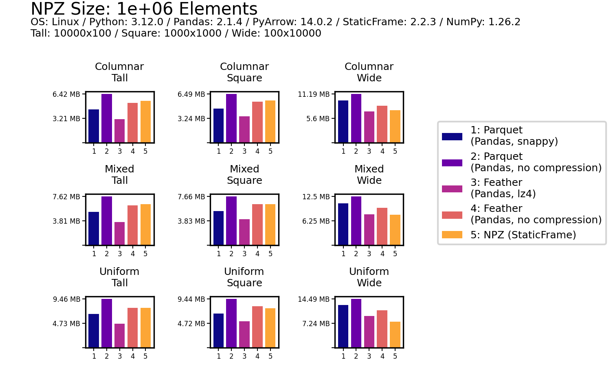
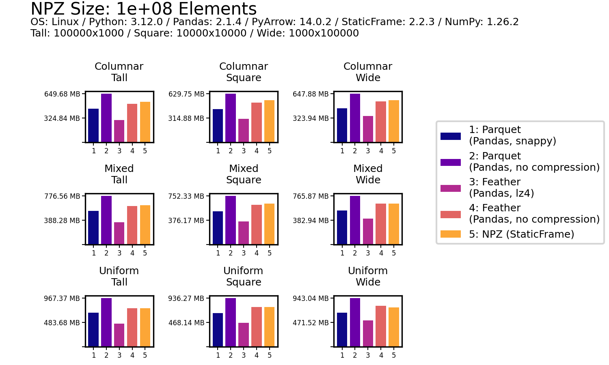
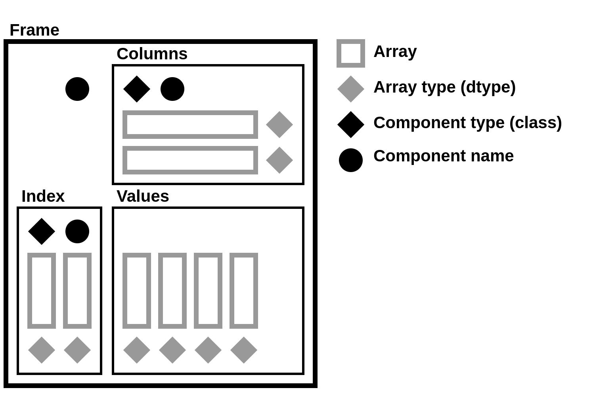
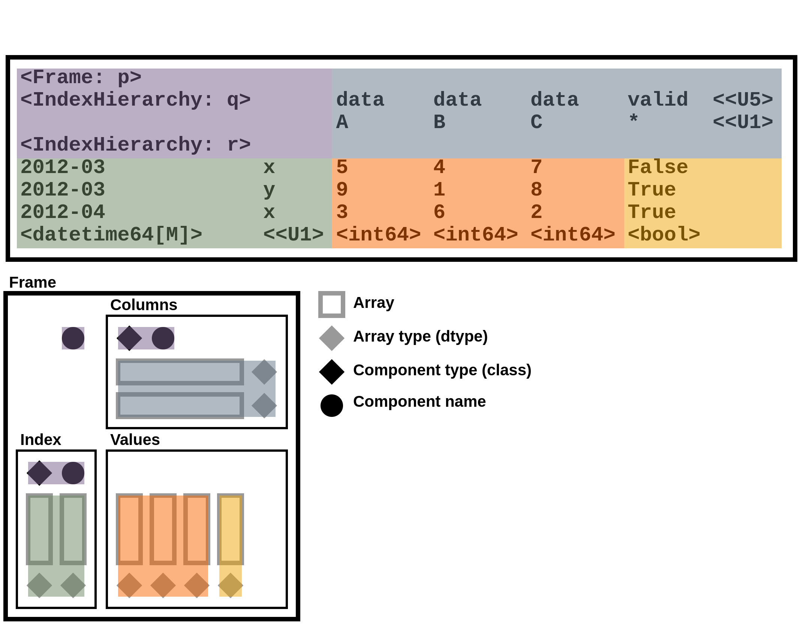
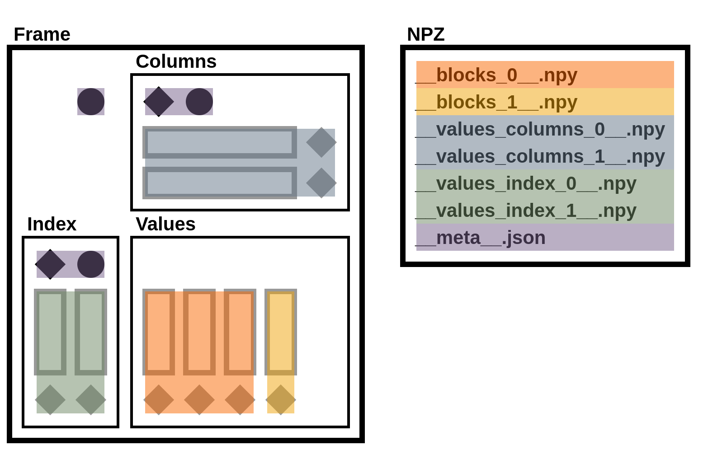
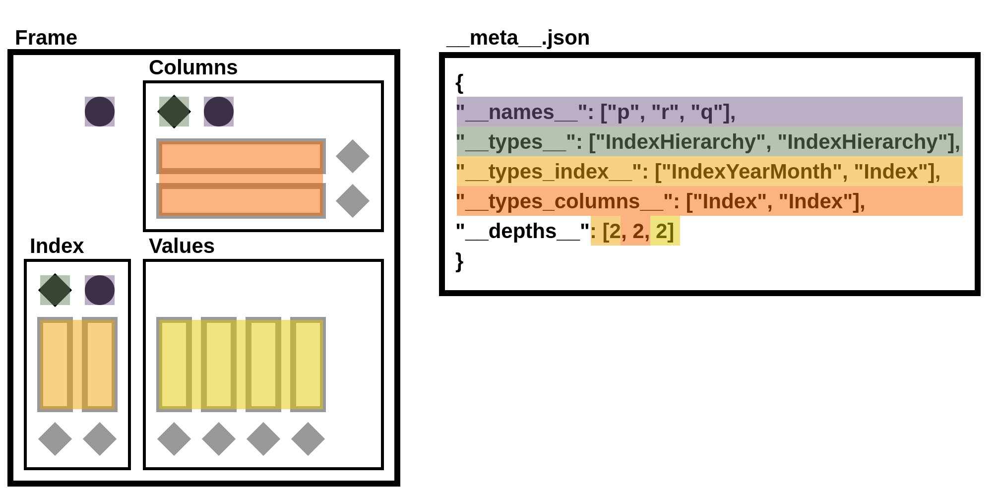

<!-- # Read and Write DataFrames Faster than Parquet with StaticFrame NPZ Serialization -->

# Serialize DataFrames Two to Ten Times Faster than Parquet with StaticFrame NPZ


The Apache Parquet format provides an efficient binary representation of columnar table data, as seen with widespread use in Apache Hadoop and Spark, AWS Athena and Glue, and Pandas DataFrame serialization. While Parquet offers interoperability across many systems with performance superior to text formats (such as CSV or JSON), it is as much as ten times slower than NPZ, an alternative DataFrame serialization format introduced in StaticFrame [https://github.com/static-frame/static-frame].

StaticFrame (an open-source DataFrame library of which I am an author) builds upon NumPy NPY and NPZ formats to offer this high-performance alternative to Parquet. The NPY format (a binary encoding of array data) and the NPZ format (zipped bundles of NPY files) were defined in the first NumPy Enhancement Proposal in 2007 [https://numpy.org/neps/nep-0001-npy-format.html]. By extending the NPZ format with specialized JSON metadata, StaticFrame provides a complete DataFrame serialization format that supports all NumPy dtypes.

<!-- As NPY is still the "default" binary representation of NumPy array data, underlying array data in StaticFrame NPZs are directly readable within NumPy. -->


## The Challenge of Serializing DataFrames

DataFrames are not just collections of columnar data with string column labels, such as found in relational databases. In addition to columnar data, DataFrames have labelled rows and columns, and those row and column labels can be of any type or (with hierarchical labels) many types. Further, it is common to store metadata with a ``name`` attribute, either on the DataFrame or on the axis labels.

As Parquet was originally designed just to store collections of columnar data, the full range of DataFrame characteristics is not directly supported. Pandas supplies this additional information by adding JSON metadata into the Parquet file.

As Parquet was designed to support a minimal selection of types, the full range of NumPy dtypes is not directly supported. For example, Parquet does not natively support unsigned integers or any datetime or timedelta types.

While Python pickles are capable of efficiently serializing DataFrames and NumPy arrays, they are only suitable for short-term caches from trusted sources. While Pickles are fast, they can become invalid due to code changes and are insecure to load from untrusted sources.

Another alternative to Parquet, originating in the Arrow project, is Feather. While Feather supports all Arrow types and succeeds in being faster than Parquet, it is still at least two times slower at reading DataFrames than NPZ.

Parquet and Feather support compression to reduce file size on disk. Parquet defaults to using "snappy" compression, while Feather default to "lz4". As the NPZ format prioritizes performance, it does not yet support compression. As will be shown below, NPZ outperforms both compressed and uncompressed Parquet and Feather files. File size comparisons will be provided below.


## DataFrame Serialization Performance Comparisons

First, read and write performance will be examined; second, the details of encoding a DataFrame with NPY and NPZ will be described.

Numerous publications offer DataFrame performance comparisons by testing just one or two data sets[e.g. https://ursalabs.org/blog/2020-feather-v2/]. This is insufficient, as both the shape of the DataFrame and the degree of columnar type heterogeneity make a significant difference in performance.

To avoid this deficiency, I present nine performance results across two dimensions of synthetic fixtures: shape (tall, square, and wide) and columnar heterogeneity (columnar, mixed, and uniform). Shape variations alter the distribution of elements between tall (e.g., 10,000 rows and 100 columns), square (e.g., 1,000 rows and columns), and wide (e.g., 100 rows and 10,000 columns) geometries. Columnar heterogeneity variations alter the diversity of types between columnar (no adjacent columns have the same type), mixed (some adjacent columns have the same type), and uniform (all columns have the same type).

The `frame-fixtures` library defines a domain-specific language to create deterministic but randomly-generated DataFrames for testing; the nine variations of DataFrames are generated with this tool.

To demonstrate the interfaces evaluated, the following IPython session performs a basic write performance test using `%time`. StaticFrame NPZ writes this square, homogenous DataFrame almost six times faster than Parquet.

```python
>>> import numpy as np
>>> import static_frame as sf
>>> import pandas as pd

>>> array = np.random.random_sample((10_000, 10_000))

>>> f1 = sf.Frame(array)
>>> %time f1.to_npz('/tmp/frame.npz')
CPU times: user 715 ms, sys: 394 ms, total: 1.11 s
Wall time: 1.23 s

>>> df1 = pd.DataFrame(array)
>>> %time df1.to_parquet('/tmp/df.parquet', compression=None)
CPU times: user 5.87 s, sys: 790 ms, total: 6.66 s
Wall time: 6.81 s
```

Plotted performance tests, as shown below, extend this basic approach by using ``frame-fiuxtures`` for systematic variation of shape and type heterogeneity, and average results over ten iterations.


### Read Performance

As data is generally read more often then it is written, read performance is a priority. As shown for all nine DataFrames of one million (1e+06) elements, NPZ significantly outperforms Parquet and Feather with every fixture. NPZ read performance is nearly ten times faster than compressed Parquet. For example, with the Uniform Tall fixture, compressed Parquet reading is 21 ms compared to 1.5 ms with NPZ.

The chart below shows processing time, where lower bars correspond to faster performance.




This impressive NPZ performance is retained with scale. Moving to 100 million (1e+08) elements, NPZ continues to be at least twice as fast as Parquet and Feather, regardless of if compression is used.


### Write Performance

As data is generally read more often then it is written, write performance is secondary. Nonetheless, NPZ outperforms Parquet (both compressed and uncompressed) in all write scenarios. For example, with the Uniform Square fixture, compressed Parquet writing is 200 ms compared to 18.3 ms with NPZ.





As with read performance, NPZ write performance is retained with scale. Moving to 100 million (1e+08) elements, NPZ continues to be at least twice as fast as Parquet, regardless of of if compression is used or not. Feather write performance (both compressed and uncompressed) out-performs NPZ in a few scenarios, but NPZ write performance is generally comparable to Feather (and in a few scenarios faster).


### File Size

As shown below for 1e6 and 1e8 element DataFrames, uncompressed NPZ is generally equal in size on disk to uncompressed Feather. This size is almost always smaller than uncompressed Parquet. Compression provides modest file size reductions for Parquet and Feather.






## Serializing DataFrames

StaticFrame stores data as a collection of 1D and 2D NumPy arrays. Arrays represent columnar values, as well as variable-depth index and column labels. In addition to NumPy arrays, information about the component type (i.e., the Python class used for the index and columns), as well as the component ``name`` attributes, are needed to fully reconstruct a ``Frame``. Serializing a DataFrame requires writing and reading these components to a file.

These DataFrame components can be represented by the following diagram, which isolates arrays, array types, component types, and component names.



The components of that diagram map to components of a ``Frame`` string representation. For example, given a ``Frame`` of integers and Booleans, with hierarchical labels on both the index and columns, the following string representation is provided:

```python
>>> frame
<Frame: p>
<IndexHierarchy: q>       data    data    data    valid  <<U5>
                          A       B       C       *      <<U1>
<IndexHierarchy: r>
2012-03             x     5       4       7       False
2012-03             y     9       1       8       True
2012-04             x     3       6       2       True
<datetime64[M]>     <<U1> <int64> <int64> <int64> <bool>
```

The components of the string representation can be mapped to the diagram by color:




### Encoding an Array in NPY

An NPY file stores an n-dimensional NumPy array as a binary file with six components: a "magic" prefix, a version number, a header length and header (where the header is a string representation of a Python dictionary), and padding followed buy raw array byte data. These components are shown below for a three-element binary array stored in a file named "__blocks_1__.npy".


Given an NPZ file, we can see those same components by reading the NPY file from the NPZ:

```python
>>> with ZipFile('/tmp/frame.npz') as zf: print(zf.open('__blocks_1__.npy').read())
b'\x93NUMPY\x01\x006\x00{"descr":"<i8","fortran_order":True,"shape":(3,)}    \n\x04\x00\x00\x00\x00\x00\x00\x00\x01\x00\x00\x00\x00\x00\x00\x00\x06\x00\x00\x00\x00\x00\x00\x00'
```

As an NPY file can encode any n-dimensional array, large 2D arrays can be loaded from contiguous byte data, providing excellent performance in StaticFrame when multiple contiguous columns are represented by a single array.

### Building an NPZ File

An NPZ is a ZIP file that contains array data in NPY files and metadata (containing component types and names) in a single JSON file.

Given the NPZ file for the ``Frame`` showed above, we can list its contents with the Python standard library ``ZipFile``:

```python
>>> with ZipFile('/tmp/frame.npz') as zf: print(zf.namelist())
['__values_index_0__.npy', '__values_index_1__.npy', '__values_columns_0__.npy', '__values_columns_1__.npy', '__blocks_0__.npy', '__blocks_1__.npy', '__blocks_2__.npy', '__blocks_3__.npy', '__meta__.json']
```

The diagram below maps these files to components of the DataFrame diagram.



Components of the ``__meta__.json`` file are similarly mapped to components of the DataFrame diagram, below:



That an NPZ file is simply a ZIP provides broad compatability for alternative readers. The ZIP format, given its history and generality, does incur some overhead. StaticFrame implements a custom ZIP reader optimized for NPZ usage, which contributes greatly to the excellent read performance of NPZ.

# Conclusion

The performance of DataFrame serialization is critical to many applications. While Parquet has widespread support, its generality compromises type specificity and, as shown with StaticFrame NPZ, performance. While NPZ performance is comparable Feather, NPZ retains significant advantages in read performance while fully supporting all NumPy dtypes.


